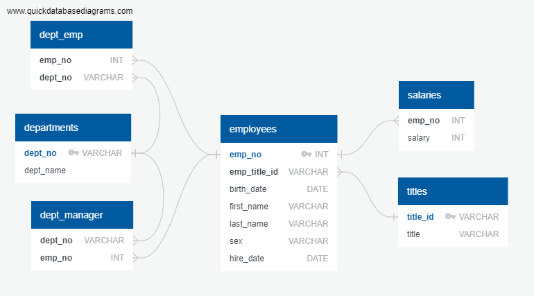
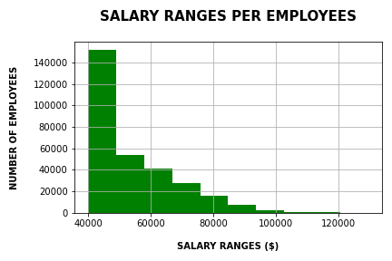
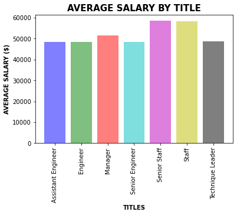

# Employee Database: A Mystery in Two Parts

## Background

The objective of this project is to research on employees of the "Pewlett Hackard" corporation from the 1980s and 1990s. 

### Data Modeling

The Pewlett Hackard database contains the following files:

- departments.csv
- dept_emp.csv
- dept_manager.csv
- employees.csv
- salaries.csv
- titles.csv

By inspecting the data in original files, I propose the following ERD 

### Data Engineering

The schema creation can be found here: [schema](EmployeeSQL/schema.sql)

### Data Analysis

The data analysis performed can be found here: [analysis](EmployeeSQL/data_analysis.sql)

### BONUS:

1. Import the SQL database into Pandas

2. Create a histogram to visualize the most common salary ranges for employees.

3. Create a bar chart of average salary by title.

